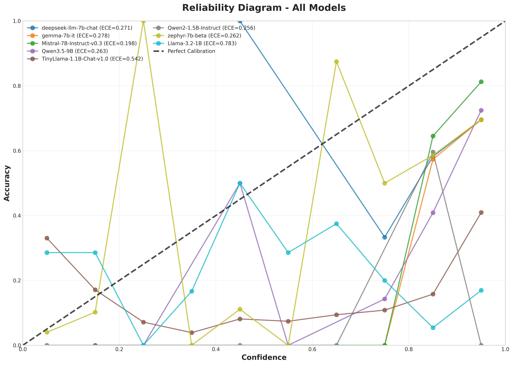
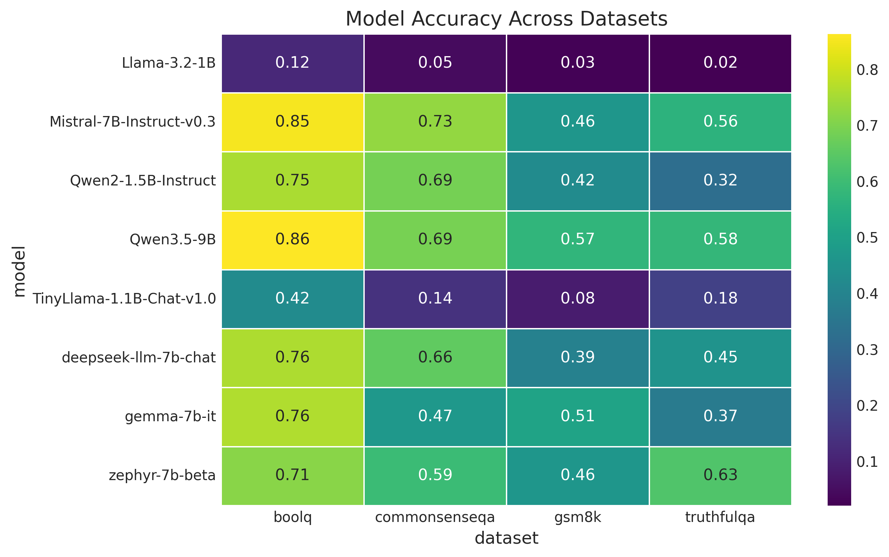
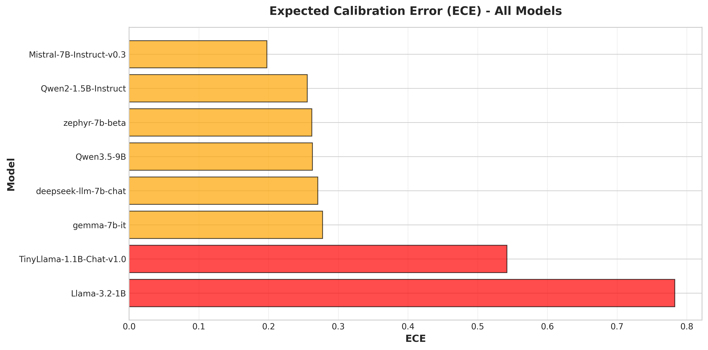
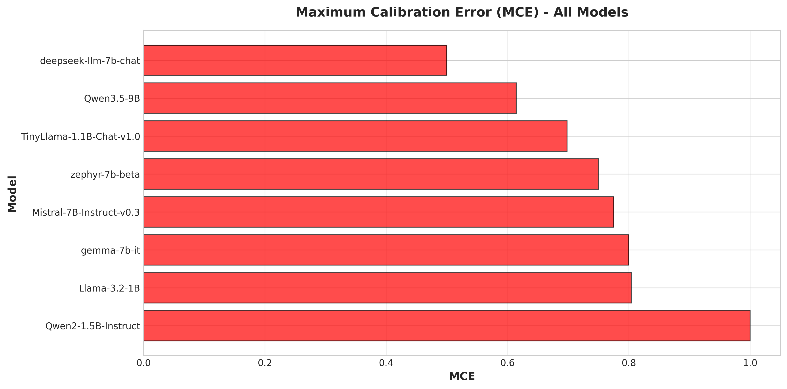
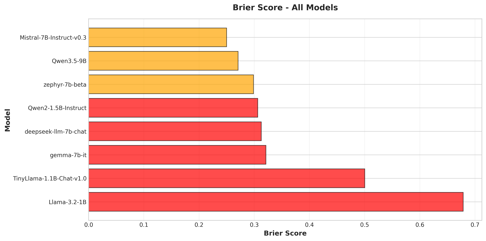
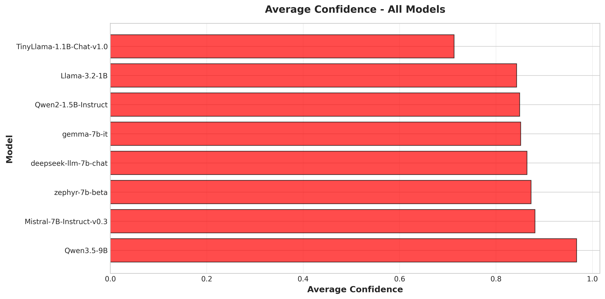
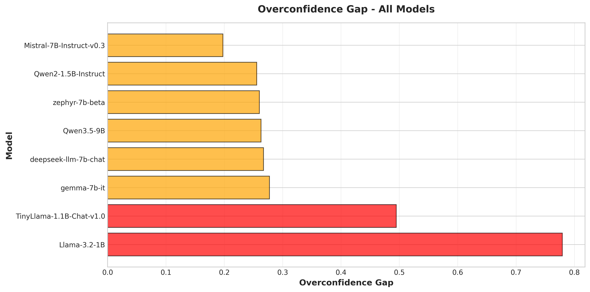
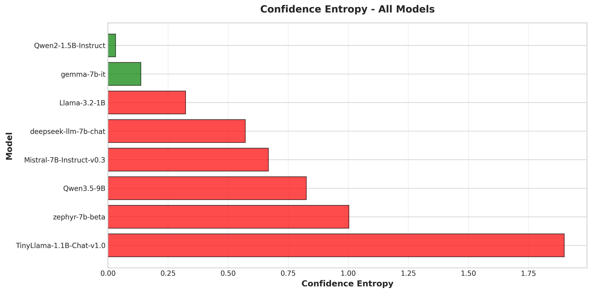

# LLM Confidence Calibration Benchmark

This project evaluates the confidence reliability and calibration behavior of open-source large language models (LLMs) across multiple reasoning tasks. The framework benchmarks LLM predictions on diverse datasets and analyzes how well model-reported confidence aligns with actual correctness.

## 🎯 Goal
To analyze whether modern open-source LLMs are well-calibrated, and how calibration varies across different task types such as reasoning, binary decision making, common sense and factual truthfulness.

## 📚 Motivation
While LLMs can produce highly confident responses, their confidence does not always reflect true correctness. Understanding and evaluating calibration is critical for deploying LLMs in real-world decision-making systems.

## 📈 Key Visualizations

### Overall Reliability Diagram

*A combined reliability diagram showing how well-calibrated each model is across all evaluated tasks.*

### Model Accuracy Across Datasets

*A heatmap indicating the varying performance of models on different reasoning datasets.*

## 🛠️ Key Features
- **Evaluation across multiple open-source LLMs**
- **Multi-dataset benchmarking:** GSM8K, BoolQ, TruthfulQA, CommonSenseQA
- **Confidence extraction** from model responses
- **Semantic answer evaluation** using sentence embeddings
- **Calibration analysis** using metrics such as Expected Calibration Error (ECE), Maximum Calibration Error (MCE), and Brier Score
- **Reliability diagrams** and confidence distribution visualization

## 📂 Project Structure

This repository is designed to be fully reproducible on Kaggle as well as locally while maintaining all source code and analysis in one organized place.

```shell
├── notebooks/
│   ├── 01_dataset_creation.ipynb     # Extracts and prepares reference datasets
│   ├── 02_model_evaluation.ipynb     # Runs LLM inference & confidence extraction
│   └── 03_analysis_visualization.ipynb # Computes calibration metrics & creates plots
├── data/                             # Processed Parquet/CSV files 
│   ├── Confidence_calibration_study_dataset.csv
│   └── Confidence_calibration_study_dataset.parquet
├── results/                          # LLM Inference & Confidence Extraction Results
├── outputs/                          # Output figures, reliability diagrams, and tables
├── src/                              # Reusable Python scripts for local replication
├── README.md
└── requirements.txt                  # Dependencies needed for local replication
```

## 📊 Datasets & Findings
- **Processed Datasets for Evaluation:** [LLM Calibration Benchmark - Processed Datasets](https://www.kaggle.com/datasets/nikhil2003verma/llm-calibration-benchmark-processed-datasets)
- **Evaluation Results:** [LLM Calibration Benchmark - Evaluation Results](https://www.kaggle.com/datasets/nikhil2003verma/llm-calibration-benchmark-evaluation-results)
- **Final Findings:** [LLM Calibration Benchmark - Final Result](https://www.kaggle.com/datasets/nikhil2003verma/llm-calibration-benchmark-final-result)

## 🤖 Models Used
The pipeline supports evaluating a wide variety of models. Note that some models are **gated**, which means you need to request access from their respective authors on Hugging Face before you can use them.

### Evaluated Models
- [meta-llama/Llama-3.2-1B](https://huggingface.co/meta-llama/Llama-3.2-1B) *(Gated)*
- [google/gemma-7b-it](https://huggingface.co/google/gemma-7b-it) *(Gated)*
- [TinyLlama/TinyLlama-1.1B-Chat-v1.0](https://huggingface.co/TinyLlama/TinyLlama-1.1B-Chat-v1.0)
- [Qwen/Qwen3.5-9B](https://huggingface.co/Qwen/Qwen3.5-9B)
- [mistralai/Mistral-7B-Instruct-v0.3](https://huggingface.co/mistralai/Mistral-7B-Instruct-v0.3)
- [Qwen/Qwen2-1.5B-Instruct](https://huggingface.co/Qwen/Qwen2-1.5B-Instruct)
- [HuggingFaceH4/zephyr-7b-beta](https://huggingface.co/HuggingFaceH4/zephyr-7b-beta)
- [deepseek-ai/deepseek-llm-7b-chat](https://huggingface.co/deepseek-ai/deepseek-llm-7b-chat)

### Models Not Evaluated (Due to Kaggle Free Tier Limitations)
- [meta-llama/Llama-3.1-8B-Instruct](https://huggingface.co/meta-llama/Llama-3.1-8B-Instruct) *(Gated)*
- [microsoft/Phi-4-mini-instruct](https://huggingface.co/microsoft/Phi-4-mini-instruct)
- [microsoft/phi-4](https://huggingface.co/microsoft/phi-4)
- [google/gemma-3-12b-it](https://huggingface.co/google/gemma-3-12b-it) *(Gated)*

## 🚀 How to Run (Kaggle Workflow)

The entire pipeline is split into three Kaggle Notebooks to manage computational constraints (especially GPU time for LLM inference). 

### Step 1: Dataset Creation
1. Open [`notebooks/01_dataset_creation.ipynb`](notebooks/01_dataset_creation.ipynb) in Kaggle.
2. Run the notebook to fetch and format GSM8K, BoolQ, TruthfulQA, and CommonSenseQA.
3. The notebook will output `.parquet` and `.csv` files.

### Step 2: Model Evaluation & Confidence Extraction
1. Open [`notebooks/02_model_evaluation.ipynb`](notebooks/02_model_evaluation.ipynb) in Kaggle.
2. Enable a GPU accelerator (e.g., T4 x2).
3. Mount the Kaggle Dataset created in Step 1.
4. **Set Up Hugging Face Token:** You must set your Hugging Face API token in Kaggle Secrets (`Add-ons` -> `Secrets`) under the name `HF_TOKEN`. Make sure the token has **read access**.
5. **Kaggle Limits Warning:** To stay within Kaggle's limits and successfully get results, you may need to run the evaluation pipeline for models in smaller batches/pairings rather than running all models at once.
6. Run inference for your chosen open-source LLMs.

### Step 3: Analysis & Visualization
1. Open [`notebooks/03_analysis_visualization.ipynb`](notebooks/03_analysis_visualization.ipynb) in Kaggle.
2. Mount the dataset containing the LLM predictions (from Step 2).
3. Run the notebook to calculate ECE, MCE, Brier Scores, and generate reliability diagrams.

## 💻 How to Run Locally

You can also run the evaluation pipeline locally using the extracted Python scripts.

### Prerequisites

1. Clone the repository and navigate into it.
2. Install the required dependencies:
   ```bash
   pip install -r requirements.txt
   ```
3. **Set up Hugging Face API Token:**
   - Go to your Hugging Face account settings and generate an Access Token with **read permissions**.
   - Copy the `.env.example` file and rename it to `.env` (or create a new `.env` file in the root directory).
   - Add your token to the file:
     ```env
     HF_TOKEN=your_huggingface_token_here
     ```

### Running the Scripts

1. **Dataset Creation**: Run the dataset creation script to download and prepare the datasets. The outputs will be saved in the `data/` directory.
   ```bash
   python src/01_dataset_creation.py
   ```
2. **Model Evaluation**: Run the evaluation script. This will load models, verify predictions, and extract confidence scores. Output files will be saved in the `results/` folder.
   ```bash
   python src/02_model_evaluation.py
   ```
3. **Analysis & Visualization**: Run the analysis script to calculate calibration metrics and generate reliability diagrams. Output files will be saved in the `outputs/` directory.
   ```bash
   python src/03_analysis_visualization.py
   ```

## 🖼️ Full Output Gallery

Below are the complete comparison charts generated across all evaluated models:

### Expected Calibration Error (ECE)


### Maximum Calibration Error (MCE)


### Brier Score


### Average Confidence Comparison


### Overconfidence Gap


### Confidence Entropy


*(Note: Additional granular figures like individual ECE breakdowns and confidence distributions are generated within [`outputs/figures/individual_models/`](outputs/figures/individual_models/))* 

#### If anyone finds this benchmark useful, don't forget to ⭐️ star the repo! 😉